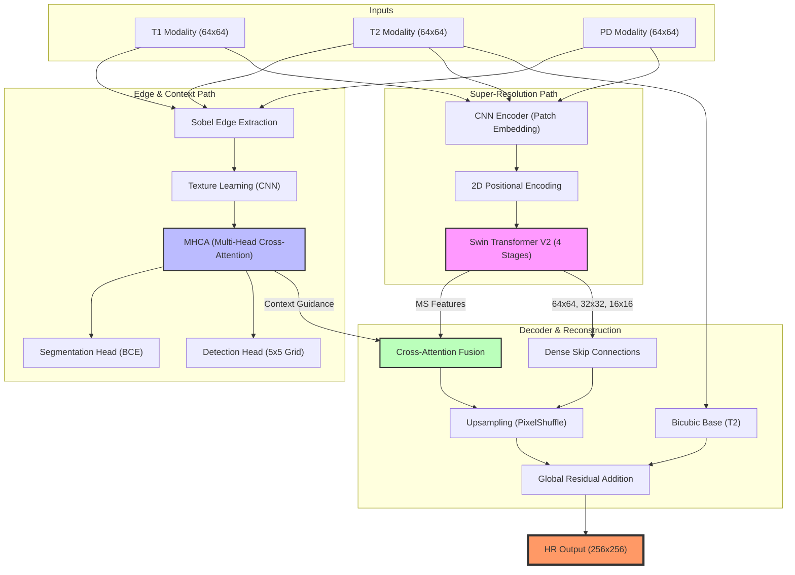

# Swin-MMHCA Architecture Diagram

This diagram visualizes the dual-path flow, multi-task heads, and the fusion mechanism of the Swin-MMHCA model.

```mermaid
graph TD
    %% Inputs
    subgraph Inputs
        T1["T1 Modality (64x64)"]
        T2["T2 Modality (64x64)"]
        PD["PD Modality (64x64)"]
    end

    %% Edge Path
    subgraph "Edge & Context Path"
        Sobel["Sobel Edge Extraction"]
        TexBranch["Texture Learning (CNN)"]
        MHCA["MHCA (Multi-Head Cross-Attention)"]
        SegHead["Segmentation Head (BCE)"]
        DetHead["Detection Head (5x5 Grid)"]
        
        T1 & T2 & PD --> Sobel
        Sobel --> TexBranch
        TexBranch --> MHCA
        MHCA --> SegHead
        MHCA --> DetHead
    end

    %% SR Path
    subgraph "Super-Resolution Path"
        CNN_Enc["CNN Encoder (Patch Embedding)"]
        PosEnc["2D Positional Encoding"]
        SwinV2["Swin Transformer V2 (4 Stages)"]
        
        T1 & T2 & PD --> CNN_Enc
        CNN_Enc --> PosEnc
        PosEnc --> SwinV2
    end

    %% Fusion and Reconstruction
    subgraph "Decoder & Reconstruction"
        CAF["Cross-Attention Fusion"]
        Skip["Dense Skip Connections"]
        PixShuf["Upsampling (PixelShuffle)"]
        ResAdd["Global Residual Addition"]
        Bicubic["Bicubic Base (T2)"]
        
        SwinV2 -- "MS Features" --> CAF
        MHCA -- "Context Guidance" --> CAF
        CAF --> PixShuf
        SwinV2 -- "64x64, 32x32, 16x16" --> Skip
        Skip --> PixShuf
        
        T2 --> Bicubic
        PixShuf --> ResAdd
        Bicubic --> ResAdd
    end

    %% Output
    ResAdd --> HR["HR Output (256x256)"]

    %% Styling
    style SwinV2 fill:#f9f,stroke:#333,stroke-width:2px
    style MHCA fill:#bbf,stroke:#333,stroke-width:2px
    style CAF fill:#bfb,stroke:#333,stroke-width:2px
    style HR fill:#f96,stroke:#333,stroke-width:4px
```
